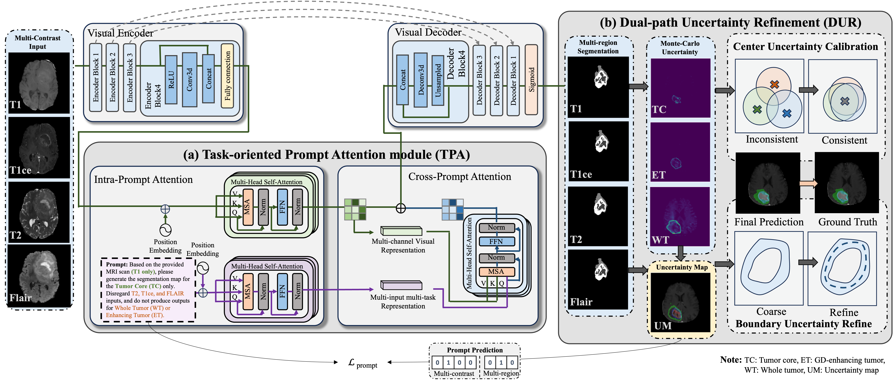

# Task-oriented Uncertainty Collaborative Learning (TUCL) for Label-Efficient Brain Tumor Segmentation
this is the repo for tucl_brainseg



> 🚀 A deep learning framework for multi-contrast brain tumor segmentation with uncertainty modeling.

---

## 📖 Table of Contents
- [Abstract](#abstract)
- [Installation](#installation)
- [Usage](#usage)
- [Dataset](#dataset)
- [Model Architecture](#model-architecture)
- [Results](#results)
- [Citation](#citation)

---

## 🧠 Abstract
Multi-contrast MRI is essential for brain tumor segmentation as different contrasts highlight distinct tumor characteristics. However, multi-contrast segmentation remains challenging due to **data heterogeneity, granularity differences, and redundant information interference**, especially under limited labeled data.

We introduce **Task-oriented Uncertainty Collaborative Learning (TUCL)**, a novel segmentation framework that enhances feature interactions across contrasts and tasks by integrating:

- **Task-oriented Prompt Attention (TPA)**: Leverages intra- and cross-prompt attention mechanisms to model contrast-specific interactions.
- **Cyclic Prompt Mapping**: Reinforces consistency by mapping predictions back into the prompt space.
- **Dual-path Uncertainty Refinement (DUR)**: Iteratively calibrates region centers and refines boundaries for robust segmentation.

TUCL achieves **state-of-the-art performance**, improving segmentation accuracy to **88.2% Dice** and reducing boundary errors to **10.853 mm HD95** under limited supervision.

---

## ⚙️ Installation
```bash
git clone https://anonymous.4open.science/r/TUCL_BrainSeg-1C2F.git
cd TUCL_BrainSeg
pip install -r requirements.txt
```

---

## 🚀 Usage
```python
import torch
from model import TUCL_Network

# Load pre-trained model
model = TUCL_Network()
model.load_state_dict(torch.load('tucl_checkpoint.pth'))
model.eval()

# Perform inference
input_image = torch.randn(1, 4, 256, 256, 128)  # Example multi-contrast MRI input
output_segmentation = model(input_image)
```

---

## 📂 Dataset
TUCL is evaluated on the **BraTS 2021 dataset**, which includes:
- **MRI Modalities**: T1, T1ce, T2, FLAIR
- **Segmentation Targets**: Enhancing Tumor (ET), Whole Tumor (WT), Tumor Core (TC)

More details on data preparation can be found in the [dataset documentation](dataset/README.md).

---

## 🏗 Model Architecture
The TUCL framework comprises:
1. **Task-oriented Prompt Attention (TPA)**: Models multi-contrast interactions using intra- and cross-prompt attention.
2. **Cyclic Prompt Mapping**: Ensures robust representation learning by integrating segmentation predictions into prompt learning.
3. **Dual-path Uncertainty Refinement (DUR)**: Refines center and boundary predictions for accurate segmentation.

---

## 📊 Results
| Method  | Dice (%) ↑ | HD95 (mm) ↓ |
|---------|-----------|-------------|
| UNet  | 78.2 | 17.395 |
| Att-UNet | 81.1 | 16.175 |
| SegResNet | 78.9 | 18.012 |
| VNet | 74.0 | 20.112 |
| TransBTS | 78.3 | 13.171 |
| MedNext | 84.6 | 16.903 |
| **TUCL (Ours)** | **88.2** | **10.853** |

TUCL achieves the **best segmentation performance**, outperforming existing models in **accuracy and robustness**.


